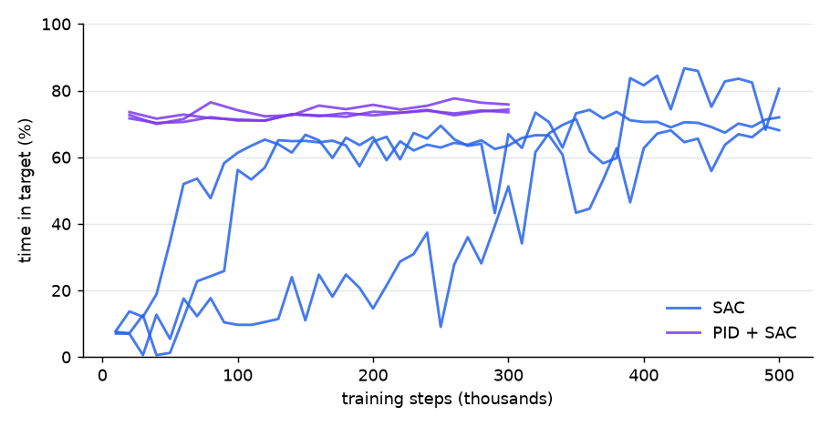

# Teaching an AI to dose anaesthesia

During surgery an anaesthetist keeps adjusting the propofol dose so the patient stays at the right depth: too little and they can wake up, too much and blood pressure drops. I wanted to see whether a reinforcement learning agent (Soft Actor-Critic) could learn that job, and whether it could beat a well-tuned PID controller on patients it had never seen.

This started as coursework for the RL module of my MSc at Imperial in January 2026. I came back to it in September, after my thesis, and rebuilt the evaluation because the original one was far too easy (see [How this evolved](#how-this-evolved)).


*40 minutes of surgery sped up to 30 seconds. A 72-year-old patient from the test set, same monitor noise and same surgical stimulation for both controllers. The PID's standard induction dose puts her far too deep (BIS under 10). SAC avoids that, but only by leaving her awake for the first three minutes. [MP4 version](media/sac_vs_pid.mp4).*

**Short answer: no.** On 30 unseen patients the tuned PID kept BIS in range 81% of the time. Pure SAC got 71% and learned a shortcut no clinician would accept. SAC learning corrections on top of the PID got 79%. Why they lost turned out to be more interesting than the scores.

## Why this is hard

- Patients respond very differently to the same dose. Each simulated patient gets their own variation in how the drug spreads, clears and acts.
- The depth signal (BIS: about 93 awake, 40 to 60 is the surgical target) arrives 20 s late and noisy, like a real monitor.
- Surgical stimulation pushes BIS back up at random moments.
- The controller only gets what a clinician would have: the BIS reading, the pump history, age and weight. No drug concentrations.

## Results on 30 unseen patients

Three controllers, each tested on the same 30 patients with identical noise and stimulation:

- **PID:** tuned clinical-style baseline.
- **SAC:** pure reinforcement learning, choosing the bolus and infusion directly.
- **PID + SAC:** residual reinforcement learning. The PID runs underneath and SAC learns bounded corrections (about ±3 mg/kg/h on the infusion, 0.6× to 1.4× on the induction bolus). With zero correction it is exactly the PID.

| Metric | PID (tuned) | SAC (3 seeds) | PID + SAC (3 seeds) |
|---|---|---|---|
| Time in target, BIS 40-60 (%) | **81.2** | 71.3 ± 1.8 | 78.5 ± 0.8 |
| MDAPE, inaccuracy (%) | **8.0** | 11.8 ± 1.1 | 8.4 ± 0.4 |
| MDPE, bias (%) | 1.9 | **0.5 ± 0.3** | 2.1 ± 0.1 |
| Wobble (%) | **6.1** | 7.4 ± 1.0 | 6.7 ± 0.2 |
| Time too deep, BIS < 40 (%) | **8.8** | 14.4 ± 2.2 | 11.9 ± 0.9 |
| Lowest BIS reached | **33.1** | 32.4 ± 4.8 | 29.6 ± 0.9 |
| Induction time (min) | 2.0 | 1.7 ± 0.8 | **1.2 ± 0.1** |
| Maintenance propofol (mg/kg/h) | 7.1 | 6.8 ± 0.7 | **6.7 ± 0.1** |

Per patient: pure SAC beat the PID on 3 of 30 patients; PID + SAC beat it on 9 of 30 and was worse on 18. Metrics are for the maintenance phase; ± is the spread across training seeds.

<p>
 
</p>

*Left: every dot is one unseen patient; above the diagonal, the RL controller did better than the PID. Right: validation learning curves (pure SAC was validated on 8 patients, PID + SAC on 20; neither uses the test set).*


*BIS over the 40 min case for six test patients, PID vs PID + SAC. Both controllers get the same monitor noise and surgical stimulation. Shaded band: target range.*

## Why the RL agents lost

**Pure SAC found a shortcut.** In older patients it learned to skip the induction bolus and hold off for about three minutes, then run the infusion at maximum. It learned this because the PID's fixed bolus overdoses older patients (the video shows BIS below 10 for ten minutes), and waiting avoids that. But a patient left awake at the start of surgery is a failure a clinician would never accept. Adding a penalty for staying too light did not get rid of it. The agent optimises the reward I wrote, loopholes included.

**Residual SAC couldn't even beat the controller it started from.** It starts as the PID and only has to learn small corrections, yet on the validation patients its corrections made its own reward worse (211 vs 285 with no correction). So it's not a reward problem, the learning itself fails. My best guess is credit assignment: a dose change only shows up in the measured BIS 30 to 60 s later (drug equilibration plus the monitor delay), and the PID underneath partly cancels each correction, so the agent can't tell what its own actions did.

**Where RL did help:** PID + SAC induced faster (1.2 vs 2.0 min), used slightly less propofol, and beat the PID on 9 of 30 patients. Pure SAC had the lowest bias of the three.

Training was also unstable: pure SAC's curves differ a lot between seeds and collapse and recover mid-run, which is why everything is reported over three seeds with a best-on-validation checkpoint.

## What I'd try next

- Give the agent memory (a recurrent policy, or a stacked history of BIS and doses) so it can link a dose to an effect that shows up a minute later.
- Pre-train the policy to copy the PID, then fine-tune with RL, instead of starting from random dosing.
- Compare against MPC using the patient model. That's the baseline RL would really need to beat.
- Fix induction. Both the PID and SAC are worst in the first five minutes, and an age- and weight-adjusted induction dose probably gains more than anything else here.

## How this evolved

- **Jan 2026, coursework version.** SAC agent, 5 fixed patients, perfect BIS signal. It looked good, but it trained and tested on the same five patients and the agent could see the drug concentration inside the body, which no real controller can.
- **Sep 2026, rebuild.** Sampled patient population with a held-out test set, delayed noisy BIS, surgical stimulation, and a PID tuned on its own patients so the comparison is fair. Replaced the ODE solver with an exact matrix-exponential step, which made training fast enough to run three seeds on a laptop.
- **First results.** SAC scored close to PID, but the video showed it skipping induction entirely. Changed the reward to penalise staying too light.
- **Residual RL.** Tried PID + SAC corrections to get the best of both. It didn't beat PID, which is where the credit-assignment explanation above comes from.

## Keeping the comparison fair

- Test patients come from a separate random stream and are never used for training or tuning.
- PID gains are grid-searched on their own tuning patients. It doses like a clinical system: age-adjusted induction bolus, then PI control with anti-windup.
- Every controller sees the same monitor noise and stimulation timing for a given test patient, so differences come from the controller, not luck.
- SAC results are mean ± spread over three training seeds.
- Metrics follow Varvel et al. (1992): bias (MDPE), inaccuracy (MDAPE), wobble, plus time in the 40 to 60 band.

## How it works

| Part | What it does |
|---|---|
| `EleveldPatient.py` | Eleveld (2018) propofol PK/PD model: 3-compartment pharmacokinetics, effect-site delay, sigmoid BIS response. The model is linear, so it is stepped with an exact matrix-exponential update (checked against an ODE solver to within 3×10⁻⁷, about 100× faster). |
| `patients.py` | Samples adult patients (age 18–80, sex, height, BMI) with log-normal variation on volumes, clearances, ke0, Ce50 and baseline BIS. |
| `AnesthesiaEnv.py` | Gymnasium environment. 5 s control steps over a 40 min case: induction by bolus, then maintenance by infusion (0–20 mg/kg/h). Delayed noisy BIS monitor and surgical stimulation events. |
| `train_sac.py` | Stable-Baselines3 SAC, 8 patients simulated in parallel, a new patient every episode. Keeps the checkpoint that scores best on validation patients. |
| `residual.py` | Residual controller: the PID proposes an action and SAC learns a bounded correction. |
| `pid_baseline.py`, `tune_pid.py` | Clinical-style PID baseline and its grid search. |
| `evaluate.py`, `benchmark.py` | Metrics, benchmark on held-out patients, figures. |
| `make_video.py` | Renders the side-by-side video above. |

**Reward** (training only, uses the true simulated BIS): a Gaussian bonus for BIS near 50, penalties for leaving the 40-60 band in either direction (with an extra penalty below 25), and small costs for drug use and abrupt dose changes. The residual agent also pays a small cost for each correction it makes.

## Limitations

- This is a simulation. The patient model is a published population model with approximate inter-patient variation (half the published variances, so every patient is controllable within the infusion limits). It is not validated on real patient data.
- BIS only. No blood-pressure control, no opioid (remifentanil) co-administration, no drug interactions.
- The disturbance model for surgical stimulation is a simple shaped offset on BIS.
- SAC was trained for 500k steps and PID + SAC for 300k steps per seed (about 8 minutes on a laptop). Longer training or other algorithms may do better; the conclusions are about these runs.
- Nothing here is suitable for clinical use.

## Run it

```bash
pip install -r requirements.txt
python tune_pid.py                        # tune the PID baseline (~1 min)
python train_sac.py --seed 0 --steps 500000               # pure SAC (repeat for seeds 1, 2)
python train_sac.py --seed 0 --steps 300000 --residual    # PID + SAC (repeat for seeds 1, 2)
python benchmark.py                                       # results table and figures (~1 min)
python make_video.py --patient 0 --model models/sac_seed2.zip
```

## References

- Eleveld, D.J. et al. (2018). Pharmacokinetic–pharmacodynamic model for propofol for broad application in anaesthesia and sedation. *British Journal of Anaesthesia*, 120(5), 942–959.
- Haarnoja, T. et al. (2018). Soft Actor-Critic: Off-policy maximum entropy deep reinforcement learning with a stochastic actor. *ICML*.
- Varvel, J.R. et al. (1992). Measuring the predictive performance of computer-controlled infusion pumps. *J Pharmacokinet Biopharm*, 20(1), 63–94.

*Originally coursework for BIOE70077 Reinforcement Learning for Bioengineers, Imperial College London.*
