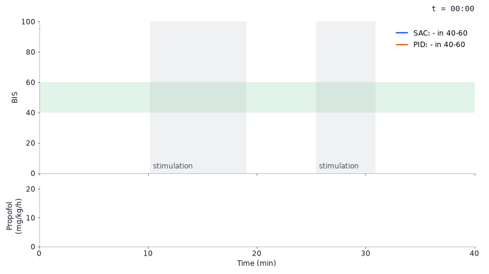
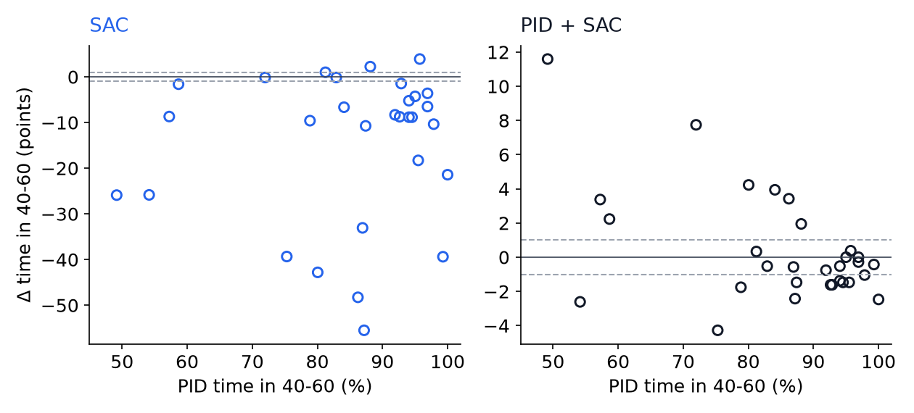
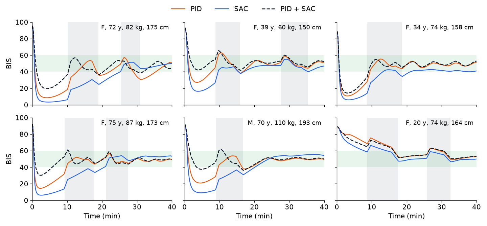

# Closed-loop propofol control: SAC vs a tuned PID

An anaesthetist keeps adjusting the propofol dose during surgery so the patient stays at the right depth. I wanted to know if reinforcement learning (Soft Actor-Critic) could do that job better than a well-tuned PID controller, on patients it had never seen.

This started as coursework in January 2026. That version trained and tested on the same five patients, had a perfect depth signal, and let the agent see the drug concentration inside the body. In September I rebuilt the evaluation so none of that is true any more.



*The best case, not a typical one: the 72-year-old test patient where PID + SAC gains most (+12 points averaged over seeds, +24 on seed 4 shown here, against +0.4 overall). The PID's bolus takes her to BIS 9, while PID + SAC gives the 1 mg/kg minimum; dots are the noisy, 20 s delayed BIS the controllers see. [MP4](media/sac_vs_pid.mp4)*

It didn't beat the PID overall. Across 30 test patients, SAC learning corrections on top of the PID ties with it (85% of the time in the 40 to 60 range for both), and pure SAC is clearly worse (70%).

## Setup

BIS (bispectral index) is the depth signal: about 93 awake, 40 to 60 for surgery, 0 for no brain activity. Patients are sampled with their own age, size and response to propofol from the [Eleveld 2018](#references) model, at half its published inter-patient variance (at full variance some can't be reached within the infusion limit). The controller sees what a clinician would: BIS 20 s late with noise, the pump history, age and weight. Surgical stimulation pushes BIS up at random times.

Each case starts with a bolus, given in 0.33 mg/kg steps (at least 1 mg/kg), then switches to an infusion once the smoothed BIS (exponential filter, α = 0.3) drops below 60, the 2.5 mg/kg budget is used, or 3 min pass. The PID gives an age-adjusted bolus (2.0 mg/kg, or 1.67 from age 55), then runs PI control on the infusion, with gains tuned on 20 separate patients. It has no D term: on the tuning patients any derivative gain made it worse, because BIS is noisy and delayed. PID + SAC learns bounded corrections to the PID's bolus size and infusion. The RL reward peaks at BIS 50 and penalises time outside 40 to 60 (more below 25), drug use and abrupt dose changes. The 30 test patients were never used for training or tuning, and every controller gets the same noise and stimulation for a given patient. For each of five training seeds I keep the checkpoint that scored best on the 20 tuning patients.

## Results

Scored from 5 to 40 min. RL columns are mean ± sd over five seeds.

| | PID | SAC | PID + SAC |
|---|---|---|---|
| Time in 40-60 (%) | 84.9 | 70.0 ± 10.1 | 85.3 ± 0.9 |
| Time below 40 (%) | 5.5 | 19.5 ± 8.5 | 5.0 ± 1.4 |
| Time above 60 (%) | 9.6 | 10.5 ± 2.9 | 9.7 ± 1.3 |
| MDAPE (%) | 7.4 | 14.5 ± 6.1 | 7.5 ± 0.2 |
| Maintenance propofol (mg/kg/h) | 7.1 | 6.6 ± 0.6 | 6.9 ± 0.2 |
| Induction bolus (mg/kg) | 1.9 | 2.5 ± 0.0 | 1.9 ± 0.2 |
| Patients reaching BIS < 20 (%) | 23 | 38 ± 3 | 18 ± 6 |

Against the PID, PID + SAC is +0.4 percentage points on time in range (95% CI −1.0 to +2.0) and SAC is −14.9 (−26.0 to −6.3), bootstrapping over seeds and patients. The other PID + SAC differences are small and uncertain; the largest, fewer patients reaching BIS < 20 (−5 points, −15 to +3), is not significant. All the intervals are in [results/benchmark.md](results/benchmark.md). MDAPE is the median absolute performance error ([Varvel 1992](#references)).



*Each point is a test patient, RL averaged over seeds; note the different y scales. (b) PID + SAC gains up to 12 points on the patients the PID handles worst and loses a point or two on many it already handles well (dashed: ±1).*



*True (noise-free) BIS for six test patients across the age range, using each RL controller's best seed on validation. Green: 40 to 60. Grey: surgical stimulation.*

## What each controller learned

Pure SAC found a loophole first. Induction could end on the 3 min timeout with no bolus, so it gave none and then ran the infusion at its limit. A penalty for time above 60 didn't stop it, so I made a 1 mg/kg minimum bolus part of the environment. Now it gives the full 2.5 mg/kg every time, and 38% of patients go below BIS 20.

PID + SAC gave the 8 test patients aged 55 and over a smaller bolus than the PID (1.47 vs 1.67 mg/kg), and their time in range went from 81% to 84%. Younger patients got slightly more (2.10 vs 2.00). Eight patients is a hint, not a result. Its infusion corrections added nothing measurable. My guess, not yet tested, is credit assignment: a dose change shows up in the measured BIS 30 to 60 s later, and the PID partly cancels each correction.

Induction is the weak point for all three. Even the PID takes 7 of 30 patients below BIS 20. The 20-year-old (bottom right) is the opposite case: she is sampled as 40% less sensitive to propofol than average and stays above 60 for 17 min under the PID and PID + SAC. SAC's larger bolus gets her down sooner.

## Code

| File | |
|---|---|
| `EleveldPatient.py` | 3-compartment PK/PD model, stepped exactly with a matrix exponential (matches an ODE solver to 3×10⁻⁷, about 100× faster) |
| `patients.py` | Patient sampling; training, tuning and test sets use separate seeds |
| `AnesthesiaEnv.py` | Gymnasium env: 5 s steps, 40 min case, delayed noisy BIS, stimulation, minimum bolus |
| `pid_baseline.py`, `tune_pid.py` | PID and its grid search |
| `train_sac.py`, `residual.py` | SAC and PID + SAC training |
| `benchmark.py`, `make_video.py` | Results table, figures, video |

```bash
pip install -r requirements.txt
python tune_pid.py
python train_sac.py --seed 0 --steps 500000              # seeds 0-4
python train_sac.py --seed 0 --steps 500000 --residual   # seeds 0-4
python benchmark.py
python make_video.py --patient 0 --model models/residual_seed4.zip
```

Five seeds of one controller take about 10 min on an Apple M5 laptop, run in parallel.

## Limitations and next steps

Simulation only, with a published population model at reduced variance. BIS only: no blood pressure, no opioid dosing. Stimulation is a simple offset on BIS. Not for clinical use.

Next I would test the age effect on more older patients, give the policy memory (recurrent, or a stack of recent BIS and doses) to handle the delay, and compare against MPC on the patient model.

## References

- Eleveld, D.J. et al. (2018). Pharmacokinetic–pharmacodynamic model for propofol for broad application in anaesthesia and sedation. *Br J Anaesth* 120(5), 942–959.
- Haarnoja, T. et al. (2018). Soft Actor-Critic. *ICML*.
- Varvel, J.R. et al. (1992). Measuring the predictive performance of computer-controlled infusion pumps. *J Pharmacokinet Biopharm* 20(1), 63–94.

*Coursework for BIOE70077 Reinforcement Learning for Bioengineers, Imperial College London.*
